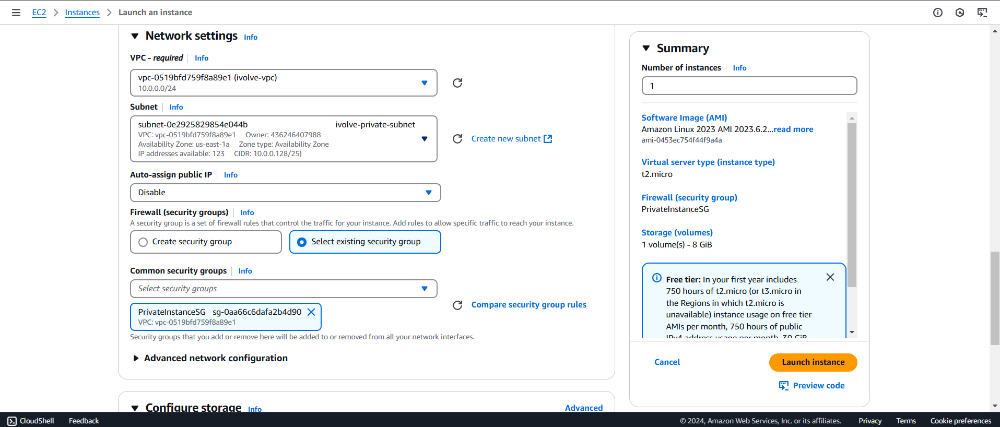

### Lab 13: Launching an EC2 Instance

#### **Objective**
1. Create a VPC with public and private subnets.
2. Launch one EC2 instance in each subnet.
3. Configure the private EC2 security group to allow inbound SSH only from the public EC2 IP.
4. SSH to the private EC2 instance using the public EC2 as a bastion host.

---

### **Steps**

#### **1. Create the VPC**
1. Navigate to the **VPC Dashboard** in AWS.
2. Click **Create VPC** and provide the following details:
   - **Name**: `ivolve-vpc`
   - **IPv4 CIDR block**: `10.0.0.0/24`
3. Save the VPC.

**Screenshot Reference**:  


---

#### **2. Create Subnets**
1. **Public Subnet**:
   - **Name**: `ivolve-public-subnet`
   - **CIDR Block**: `10.0.0.0/25`
2. **Private Subnet**:
   - **Name**: `ivolve-private-subnet`
   - **CIDR Block**: `10.0.0.128/25`

**Screenshot References**:  
- Public Subnet:   
- Private Subnet: 

---

#### **3. Create and Attach the Internet Gateway**
1. Go to **Internet Gateways** → Click **Create Internet Gateway**.
   - **Name**: `ivolve-internet-gateway`
2. Attach the Internet Gateway to the `ivolve-vpc`.

**Screenshot References**:  
- Create Internet Gateway:   
- Attach IGW: 

---

#### **4. Create Route Tables**
1. **Public Route Table**:
   - Go to **Route Tables** → Create a route table.
   - **Name**: `ivolve-public-route-table`
   - **VPC**: `ivolve-vpc`
   - Add a route to `0.0.0.0/0` pointing to the Internet Gateway.

2. **Private Route Table**:
   - **Name**: `ivolve-private-route-table`
   - **VPC**: `ivolve-vpc`

**Screenshot References**:  
- Public Route Table:   
- Private Route Table: 

---

#### **5. Launch EC2 Instances**
1. **Public EC2 Instance**:
   - Subnet: `ivolve-public-subnet`
   - Security Group: Allow **SSH (22)** from your IP.

2. **Private EC2 Instance**:
   - Subnet: `ivolve-private-subnet`
   - Security Group: Allow **SSH (22)** only from the Public EC2's IP.

**Screenshot Reference**:  
- Security Group Rules: 

---

#### **6. SSH to the Private EC2 Using the Bastion Host**
1. **Connect to the Public EC2 (Bastion Host)**:
   - Use the following command:
     ```bash
     ssh -i "your-key.pem" ec2-user@<public-ec2-ip>
     ```

   **Screenshot Reference**:  
   

2. **From the Public EC2, SSH into the Private EC2**:
   - Use this command:
     ```bash
     ssh -i "your-key.pem" ec2-user@<private-ec2-private-ip>
     ```

   **Screenshot Reference**:  
   

---

